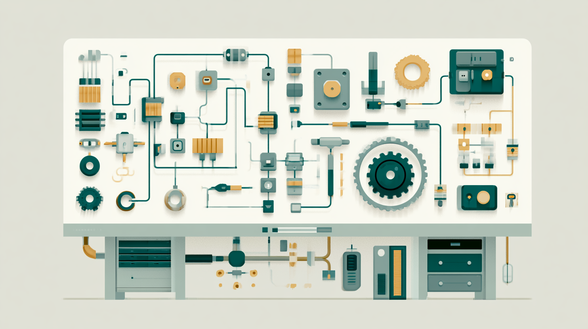

# Python Engineering Lab



A learning-in-public project. I'm a software engineer consolidating my
Python and software-engineering fundamentals by implementing one
engineering concept at a time — from scratch, by hand — and writing down
what I actually learned.

Each concept lives in its own folder and focuses on one practical pattern
at a time, with runnable code, concise documentation, and notes on
implementation decisions.

## How this lab works

- One concept per folder, numbered in order (`01-...`, `02-...`).
- I write the first version myself before looking at any reference solution.
  The point is understanding, not copying.
- Each concept folder has its own README with run instructions and notes.

## Getting started

You'll need Python 3.12 or newer.

```powershell
# Clone and enter the repo
git clone https://github.com/ajitagupta/python-engineering-lab.git
cd python-engineering-lab

# Create and activate a virtual environment
python -m venv .venv
.venv\Scripts\activate          # macOS/Linux: source .venv/bin/activate
```

Then follow the README inside whichever concept folder you want to run —
each lists its own dependencies and how to start it.

## Roadmap

| Concept | Skill | Status | Folder                                                        |
|---------|-------|--------|---------------------------------------------------------------|
| 01 — REST API | Flask routes, HTTP methods, JSON | ✅ Done | [01-rest-api](01-rest-api/)                                   |
| 02 — Validation & error handling | Input validation, status codes | ✅ Done | [02-validation-error-handling](02-validation-error-handling/) |
| 03 — Pytest API tests | Testing, test client, fixtures | ✅ Done | [03-pytest-api-tests](03-pytest-api-tests/)                   |
| 04 — SQLite persistence | Databases, storage, SQL | ✅ Done | [04-sqlite-persistence](04-sqlite-persistence/)                                                           |
| 05 — Search & filtering | Query parameters, filtering | ⬜ Planned | _coming soon_                                                 |
| 06 — Pagination | limit/offset, response metadata | ⬜ Planned | _coming soon_                                                 |
| 07 — File upload | Multipart uploads, CSV parsing | ⬜ Planned | _coming soon_                                                 |
| 08 — Background scheduler | Scheduled jobs, background tasks | ⬜ Planned | _coming soon_                                                 |
| 09 — Caching | Cache strategies, invalidation | ⬜ Planned | _coming soon_                                                 |
| 10 — Parser | Parsing, structured text | ⬜ Planned | _coming soon_                                                 |

_Scoped to ten concepts for now; the back half (architecture, performance,
production) gets planned once the pace settles._

---

_A learning project, updated as I work through it. Progress over speed —_
_one concept genuinely understood beats five rushed._
